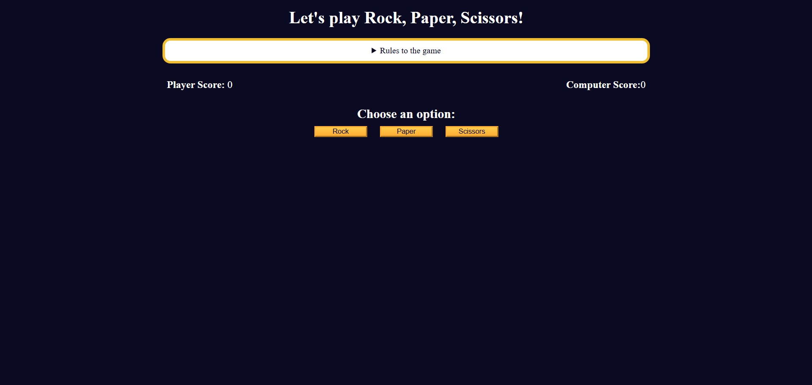

# **Rock Paper Scissors Game**

Test your luck and strategy in this classic "Rock, Paper, Scissors" game! 🪨📄✂️  

---

## **Live Demo**
[Play the Game Now! 🚀](https://anuragrauniyar.github.io/rock-paper-scissors-game)  


---

## **How to Play**
1. Select "Rock," "Paper," or "Scissors."
2. The computer will randomly choose its option.
3. Scores update based on the winner:
   - **Win:** Your choice beats the computer's.
   - **Lose:** The computer beats you.
   - **Tie:** Both choose the same option.
4. First to reach 3 points wins!

---

## **Features**
- Real-time score updates.
- Game ends with a winner announcement at 3 points.
- Reset the game anytime.

---

## **Getting Started**
1. Clone the repo:
   ```bash
   git clone https://github.com/your-username/rock-paper-scissors-game.git
2. Open index.html in your browser to start playing!

## **Screenshot**



## **Have Fun!**